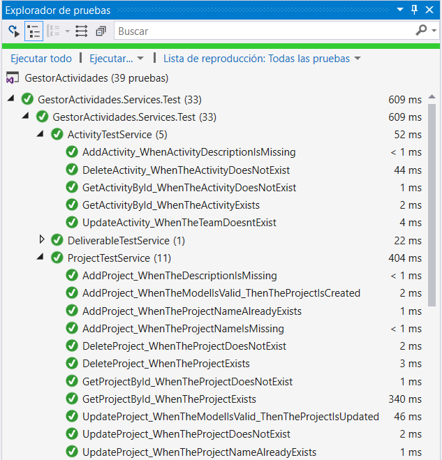

# Activity Manager

## Metodología

La metodología escogida para la ejecución del proyecto fue SCRUM, ya que este permite aplicar procesos donde se aplican de manera regular un conjunto de buenas prácticas para trabajar colaborativamente, en equipo, y obtener el mejor resultado posible de un proyecto. 

En Scrum se realizan entregas parciales y regulares del producto final, priorizadas por el beneficio que aportan al receptor del proyecto. Por ello, Scrum está especialmente indicado para proyectos como este, donde el entorno es complejo, donde se necesita obtener resultados pronto, donde los requisitos son cambiantes o poco definidos, donde la innovación, la competitividad, la flexibilidad y la productividad son fundamentales.

Aunque para este ejercicio sólo se tuvieron en cuenta 4 funcionalidades, la metodología está en la capacidad de adoptar nuevos requerimientos y nuevas entregas del mismo.

## Herramienta para SCRUM como metodología ágil

Como un acercamiento inicial a la ejecución del proyecto con la metodología SRUM, se plantan las siguientes fases las cuales permiten el correcto flujo de trabajo, logrando con éxito que el producto final cumpla con las expectativas inicialmente planteadas.

### Identificación de actores

El sistema esta incialmente planteado para ser usado por un actor que en este caso es el Cliente (Product Owner), el cual será el encargado de plantear los requerimientos y aceptar el producto final.

### Identificación de requerimientos (Product Backlog Item)

Desarrollar una funcionalidad que permita crear y modificar proyectos 
Desarrollar una funcionalidad que permita crear y modificar actividades y asociarlas a un proyecto 
Desarrollar una funcionalidad que permita crear y modificar equipo y asociarlas actividades
Desarrollar una funcionalidad que permita crear y modificar integrantes y que se asociarlas actividades

### Identificación de funcionalidades (Historias de usuarios)

* Crear CRUD para proyectos
* Crear CRUD para equipos 
* Crear CRUD para actividades
* Crear CRUD para integrantes

### Identificación de funcionalidad base

Crear información para proyectos, actividades, equipos  

### Identificación de actividades para el desarrollo de la funcionalidad base

* Crear DB-Tablas
* Crear Clase Connection
* Crear Frontend   
* Crear estilo CSS
* Crear JavaScript
* Crear modelo
* Crear Api Rest
* Crear pruebas unitarias
* Ejecutar pruebas
* Pruebas QA

### Número o cantidad de Sprint (Especificar duración de cada uno)

Para el desarrollo del se tiene estimado 4 Sprint cada uno con duración de 7 días.  El primer sprint desarrollo de los proyectos, el segundo sprint actividades, tercer sprint equipos y el cuarto integrantes.

### Cantidad de recursos en términos de perfiles (Equipo de trabajo)

**Desarrollador**  

Para el desarrollo del proyecto se necesitarán 4 desarrolladores estándar que tengan experiencia en el lenguaje de programación .NET.

**Desarrollador experto DBA**

Para el desarrollo del proyecto se necesitará 1 persona experta en base de datos.

**Desarrollador experto en QA**

Para el desarrollo del proyecto se necesitará 2 personas expertas que están evaluando constantemente la calidad del software y aseguren la calidad del mismo.

### HU: Funcionalidad base de historia de usuario. 

**Sprint 1 – Crear CRUD para proyectos**

<table>
    <thead>
        <tr>
            <th>Prioridad</th>
            <th>Como</th>
            <th>Necesito</th>
		<th>Para</th>
		<th>Criterios de aceptación</th>
        </tr>
    </thead>
    <tbody>
        <tr>
            <td rowspan=4>1</td>
            <td rowspan=4>Crear CRUD para proyectos</td>
	    <td rowspan=4>Información de los proyectos </td>
		<td rowspan=4>Registrar y almacenar la información de los proyectos </td>
            <td>1. Registrar información del proyectos</td>
        </tr>
        <tr>
            <td>2. Asociar equipos al proyecto</td>
        </tr>
        <tr>            
            <td>3. Visualización de los proyectos registrados</td>
        </tr>  
	    <tr>            
            <td>4. Eliminación de un proyecto </td>
        </tr>  
    </tbody>
</table>

**Sprint 2 – Crear CRUD para equipos**

<table>
    <thead>
        <tr>
            <th>Prioridad</th>
            <th>Como</th>
            <th>Necesito</th>
		<th>Para</th>
		<th>Criterios de aceptación</th>
        </tr>
    </thead>
    <tbody>
        <tr>
            <td rowspan=4>1</td>
            <td rowspan=4>Crear CRUD para equipos</td>
	    <td rowspan=4>Información de los equipos </td>
		<td rowspan=4>Registrar y  almacenar la información y de los equipos </td>
            <td>1. Registrar información de los equipos</td>
        </tr>
        <tr>
            <td>2. Asignar actividades del equipo</td>
        </tr>
        <tr>            
            <td>3. Visualización los equipos</td>
        </tr>
	    <tr>            
            <td>4. Eliminación de un equipo </td>
        </tr>  
    </tbody>
</table>

				
**Sprint 3 – Crear CRUD para actividades**

<table>
    <thead>
        <tr>
            <th>Prioridad</th>
            <th>Como</th>
            <th>Necesito</th>
		<th>Para</th>
		<th>Criterios de aceptación</th>
        </tr>
    </thead>
    <tbody>
        <tr>
            <td rowspan=4>1</td>
            <td rowspan=4>Crear CRUD para actividades</td>
	    <td rowspan=4>Información de  actividades de los proyectos </td>
		<td rowspan=4>Registrar y  almacenar la información y asociarla a la actividad </td>
            <td>1. Registrar información de la actividad</td>
        </tr>
        <tr>
            <td>2. Asociar a un equipo la actividad</td>
        </tr>
        <tr>            
            <td>3. Visualización las actividades a un proyectos </td>
        </tr>    
	    <tr>            
            <td>4. Eliminación de una actividad </td>
        </tr>  
    </tbody>
</table>

**Sprint 4 – Crear CRUD para integrantes**

<table>
    <thead>
        <tr>
            <th>Prioridad</th>
            <th>Como</th>
            <th>Necesito</th>
		<th>Para</th>
		<th>Criterios de aceptación</th>
        </tr>
    </thead>
    <tbody>
        <tr>
            <td rowspan=4>1</td>
            <td rowspan=4>Crear CRUD para integrantes</td>
	    <td rowspan=4>Información de integrantes de los equipos </td>
		<td rowspan=4>Registrar y  almacenar la información de los integrantes </td>
            <td>1. Registrar información de los integrantes</td>
        </tr>
        <tr>
            <td>2. Asociar a un integrante al equipo</td>
        </tr>
        <tr>            
            <td>3. Visualización de los integrantes </td>
        </tr>  
	<tr>            
            <td>4. Eliminación de un integrante </td>
        </tr>    
    </tbody>
</table>

## Unit Test

Para la inclusión de pruebas de unidad se usó la extensión de Visual Studio - UnitTest, el IDE de desarrollo provee la capacidad de ejecutar las pruebas, ver resultados, ver cobertura de código y la funcionalidad "Live Unit Testing" que advierte al momento de hacer cambios en el código si alguna de las pruebas relacionadas ha fallado, por lo que no tenemos que esperar hasta acabar de escribir el código y ejecutar pruebas para conocer el resultado de ellas haciendo más rápido el desarrollo.

Para evitar hacer llamados a otras clases y/o componentes externos como la base de datos, se usó RhinoMocks para generar Mocks de las clases que se depende y poder inyectar el comportamiento simulado en tiempo de ejecución.

  

### TDD

Usamos TDD como metodología de desarrollo, puesto que al orientar el desarrollo basado en las pruebas hace que se eviten refactors y cambios futuros que pueden ser detectados con anterioridad. Para estos se definieron los escenarios de prueba basados en los criterios de aceptación de cada historia de usuario y tomando este insumo se definieron los casos de pruebas unitarias.

### CodeCoverage

Con ayuda de la versión Enterprise de Visual Studio medimos la cobertura de las pruebas unitarias, los resultados se muestran en la siguiente gráfica.

## Code Quality (SonarQube & SonarCloud)

Con el fin de tener métricas de nuestro código y tener una idea de que tan mantenible es. Incluimos un análisis de código estático usando SonarQube, los informes de errores, defectos y vulnerabilidades encontradas en el proyecto se muestran a continuación.

### SonarCloud - OverView
Estos son los resultados del último análisis de código.

### SonarCloud - Issues

Algunos de los posibles problemas de código que la herramienta detectó por solucionar.

### SonarCloud - Measures

La gráfica muestra la confiabilidad del código y el tiempo que tomaría solucionar la deuda técnica.

### SonarCloud - Code

Tabla de resumen de más métricas del código por componentes.

### Visual Studio - métricas

Otras métricas adicionales que muestran los índices de complejidad ciclomática y acoplamiento.

## Azure DevOps

Usamos Azure DevOps como herramienta principal para el desarrollo del proyecto, puesto que soporta el manejo de épicas, historias de usuario, backlog items, dashboards, sprints, plan de pruebas y todo el soporte para DevOps.

### Board 

Se ingresan los sprints y las tareas derivadas del backlog, con el fin de llevar el seguimiento y las pruebas manuales que se deben ejecutar.

### Pipelines
Se definieron dos Pipelines uno para CI y para CD. 

#### Builds
Para el desarrollo del CI, se ha definió un build con un trigger sobre la rama master.

Cómo se muestra en la definición del build, se recupera la última versión del branch, luego se restauran los Nuget packages, se compila y se genera un zip de publicación en modo 'Release' seguido de la ejecución de pruebas unitarias y por último se almacenan los artefactos generados del build.

Después de la ejecución de las pruebas unitarias los resultados son publicados en cada build.

#### Releases

Para incluir el proceso de despliegue continuo y automático, definimos un pipeline para tomar el último build de master y desplegarlo como un servicio en Azure, a continuación, la definición del pipeline.

Los últimos despliegues realizados.

### Test Plans

#### Test Plan

* Pruebas manuales 

Con azure DevOps se establecen cuales deben ser las pruebas manuales a ejecutar.

* Pruebas de aceptación

Se genero adicionalmente el plan de pruebas en una herramienta como **POSTMAN** y finalmente se automatiza su ejecución con **NEWMAN** para así dar aceptación a cada funcionalidad.

#### Load Test

Con Azure DevOps definimos una prueba de carga usando el servicio de consulta de proyectos, para esta prueba se usaron 25 usuarios, 2625 http requests en 2min y los resultados se presentan en la siguiente gráfica.

## Authors

* **Carlos Avella** 
* **Carlos Duarte** 
* **Christian Rojas** 
* **Edgar Vásquez** 
